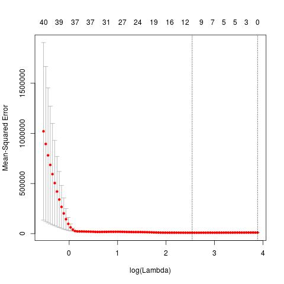
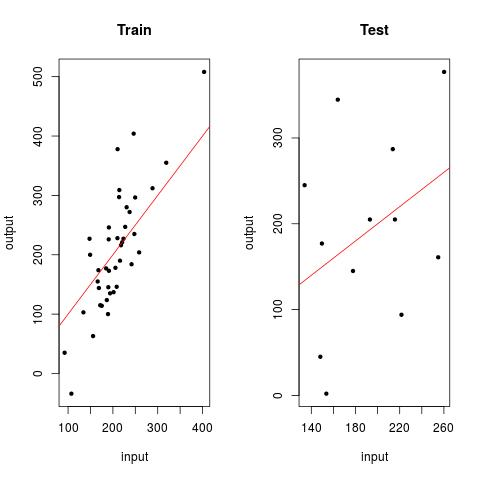
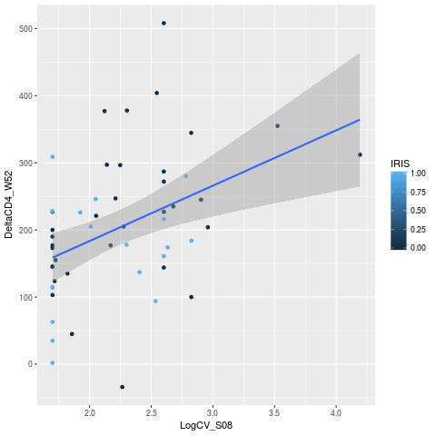

# VIH cohort Data Analysis on patients developing IRIS

## Background

The aim of this study is to find predictors for the appearence of IRIS Immune Reconstitution Inflammatory Syndrome (IRIS) in patients treated con antiretroviral therapy (ART).

## LASSO implementation

The following image shows the MSE vs lambda values. In the following simulation MSE has a local minimum value. Lambda values varies in every simulation but remains close to a value of ~ 2.5. 

Next, data were partitioned into train and test sets and LASSO were performed in the train set. LASSO cross validation was performed. Train and test model fits are shown in the next figure. From the figure it can be seen that LASSO losely fits training and test data which suggests low overfitting.

## LASSO best ranked variable is strongly corralated to output

The following plot shows LogCV_S08 (the best ranked variable of LASSO) *vs* 
the output (DeltaCD4_W52). The points are coloured in blue or black 
depending whether they belong to patients diagnosed with or without IRIS, 
respectively. A linear model is fitted which reveals that there is a 
correlation between both values.  However, it can be seen that the linear 
model is not useful to classify clinical binary outcomes.

